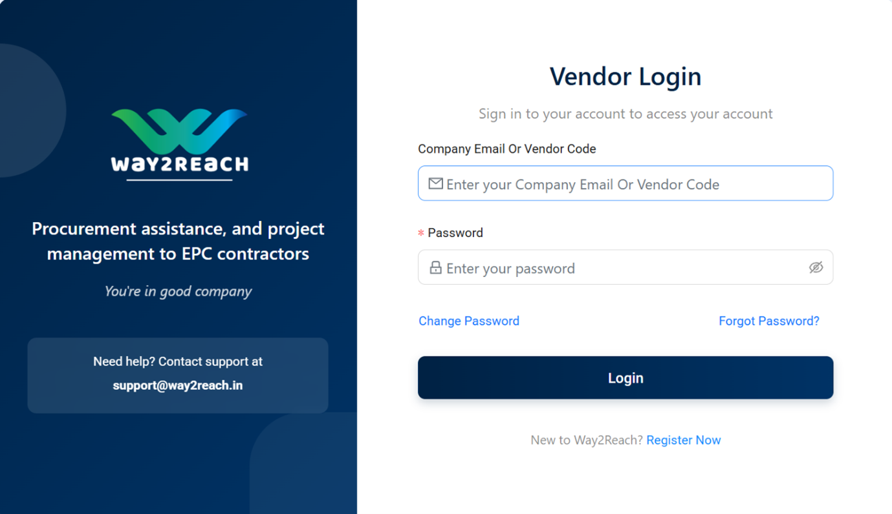

# System Navigates to Vendor Login Form

**Login link**: - [https://testway2reach.site/seller/login](https://testway2reach.site/seller/login)

---

### Step:1

#### (A) On the top-right corner of the homepage, locate the "Login" dropdown button.  

#### (B) Select "Vendor Login"  
• Click the dropdown under "Login".  
• From the list, select "Vendor Login".  

---

### Step:2

#### (A) You will be redirected to the Vendor Login form.  

#### (B) Enter Your Credentials  
• **Company Email or Vendor Code**:  
Enter your registered company email or the vendor code provided during registration.  
• **Password**:  
Enter your password. Click on the eye icon to toggle password visibility.

#### (C) Click "Login"  
• Press the Login button to access your vendor dashboard.

---

### Step:3

#### (A) Additional Options  
• **Forgot Password?**  
Click this link if you’ve forgotten your password. You’ll be guided through the password reset process.  
• **Change Password**  
Use this link to update your password if needed.  
• **New to Way2Reach?**  
Click Register Now to create a new vendor account if you are not already registered.

#### (B) Support  
• For any login issues or technical help, reach out to the support team:  
• **Email**: support@way2reach.in
