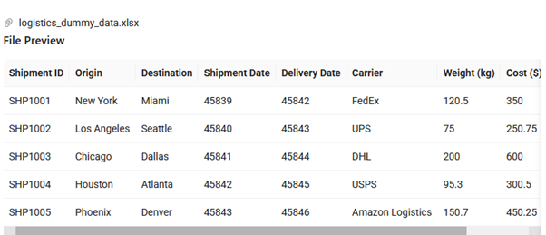
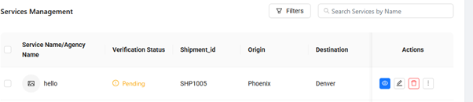
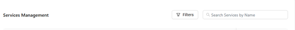
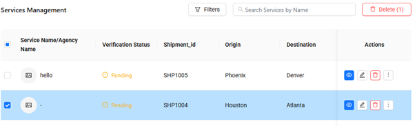
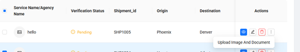
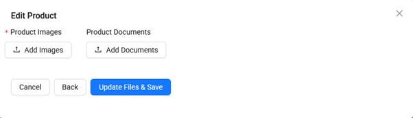
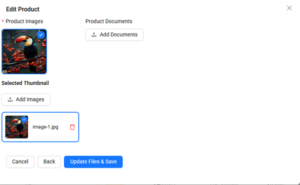

# How to Upload Your Services

1. Drop your Services file by clicking Bulk upload button  

2. This is how it will appear  

3. click Submit button  

4. After Successful Upload you will receive this notification on screen  

---

# How to Convert Your Services Listing to Excel

1. Click Export to Excel  

---

# How to Modify Any Services Details

1. click on the eye to vie the Services details  
2. click the pencil button to Update/edit Services details  
3. click the dustbin button to delete any Services  

4. To filter Services click the filters button  

5. To select any Services click the checkbox  

---

# How to Add Image to Your Services

1. Click on three dots → Upload Images and Document  

2. click Add Images to add image for Services  

4. click Update Files & Save
