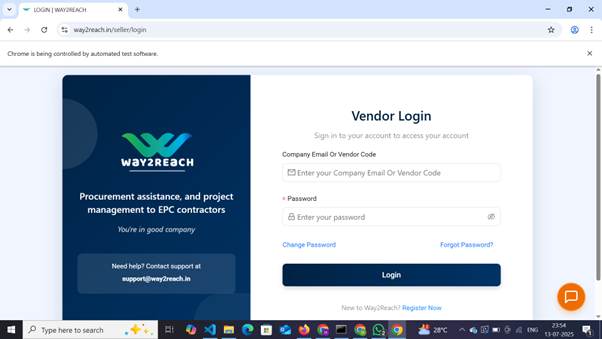
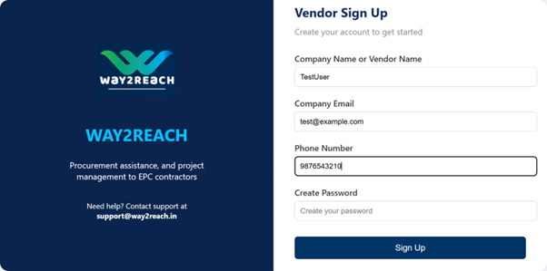
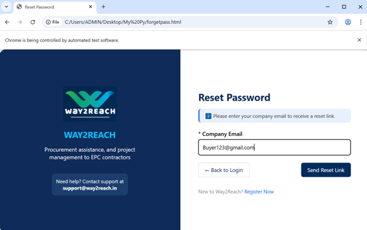
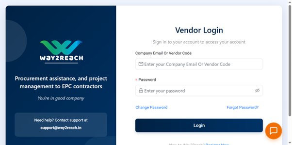

# Login Page

---

### Step 1: Open Way2Reach website  

### Step 2: Click on login button which appears on the top of the page  
### Step 3: The login button will re-direct us to the following page  

### Step 4: Enter the company email and password in the given fields.  
### Step 5: Click to the Login button to login in the Way2Reach website.  
### Step 6: If you don’t have an account then click on the registration link in the bottom of this login page.  
### Step 7: This clicking will take you to the Sign-Up Page.

---

# Sign-Up Page

---

### Step 1: Open the website of Way2Reach.  

### Step 2: Click to the registration page.  
### Step 3: Move to the sign-up page on the website.  

### Step 4: Fill the following fields.  
### Step 5: Create the password for your account.  
### Step 6: Click on the sign up page.

---

# Forget Password

---

### Step 1: Open the login page.  

### Step 2: Click on the forget password link given in the form and it will re-direct to the forget password page.  

### Step 3: Enter email in the given field.  
### Step 4: Click on send reset link button to get link in the mail to reset your password.  
### Step 5: Click on back to login button to go back to the login page.  

